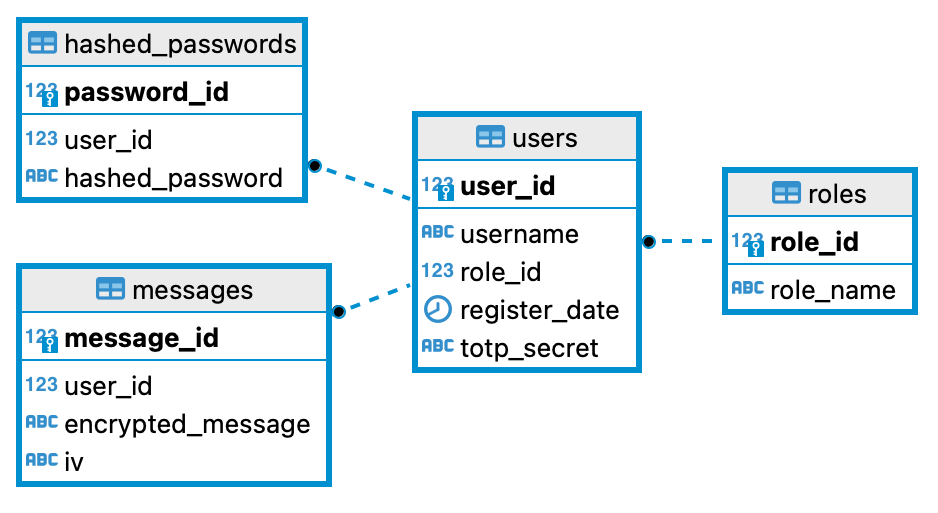

## TODOs:

- [x] База данных. Таблицы: роли, пользователи, сообщения
- [x] Двухфакторная авторизация
- [x] Хэш пароля пользователя (стрибогом)
- [x] Хэш сообщения (кузнечиком)
- [x] Выгрузка сообщений в pdf
- [x] Тесты на стрибог с примерами хешей из госта
- [ ] ~~Подпись pdf с помощью ЭЦП~~

### Стэк

- **Бэкенд:** Python 3 + FastAPI
- **Фронтенд:** Шаблонизатор Jinja2 + JavaScript
- **Двухфакторная авторизация:** код из приложения (Google Authenticator)

### ER-диаграмма



### Хэш пароля пользователя

Формула: `хэш = стрибог256(user_id + timestamp + константа_из_бэкенда + пароль)`

```python
password = 'password'
current_date = datetime.now().strftime('%Y-%m-%d')
query = text("""SELECT SETVAL(
(SELECT PG_GET_SERIAL_SEQUENCE('"users"', 'user_id')),
(SELECT (MAX("user_id") + 1) FROM "users"),FALSE)""")

 with engine.connect() as a:
     new_user_id = a.execute(query).fetchone()[0]
 data = f"{new_user_id}_{current_date}_{SALT}_{password}"
 m = GOST341112(digest_size=256)
 m.update(data.encode('utf-8'))
 print(m.hexdigest())
 ```
### Хэш сообщения 

```python
def encrypt(message: MessageIn) -> tuple[str, str]:
    gost = GOST()
    gost.set_message(string_to_bytes(message.message_text))
    gost.set_key(SUPER_SECRET_KEY)
    gost.set_operation_mode(gost.CFB)
    ciphertext = leading_zeros_hex(gost.encrypt())
    iv = leading_zeros_hex(gost.get_iv())
    return ciphertext, iv
```